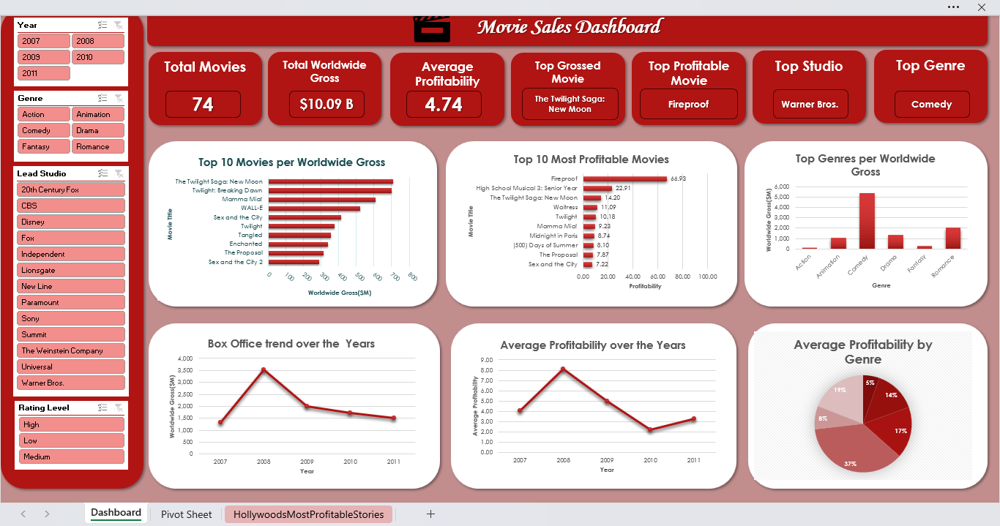

# 🎬 Movie Sales Dashboard

## 📸 Dashboard Preview

## 📊 Project Overview
This project analyzes Hollywood’s movie performance and profitability trends from 2007 to 2011 using Excel dashboards.  
The objective is to identify key drivers of box office success, including genre performance, studio dominance, and profitability trends.

Dataset used: [Hollywood’s Most Profitable Stories](https://www.kaggle.com/datasets/brendan45774/hollywood-most-profitable-stories)

---

## 📊 Key KPIs
- **Total Titles Analyzed:** 74 films  
- **Total Global Revenue:** $10.09B  
- **Average Profitability Index:** 4.74  
- **Top Grossing Movie:** *The Twilight Saga: New Moon*  
- **Most Profitable Movie:** *Fireproof*  
- **Top Studio:** Warner Bros.  
- **Top Performing Genre:** Comedy  

---

## 📈 Visualizations
- Top 10 Movies by Worldwide Gross  
- Top 10 Most Profitable Movies  
- Genre-wise Revenue Analysis  
- Box Office Trends (2007–2011)  
- Average Profitability by Genre  

---

## 📌 Key Insights
- Warner Bros dominates both production and revenue performance  
- Comedy films show the highest average profitability  
- Box office performance peaks around 2009–2010  
- High revenue does not always indicate high profitability  
- Certain mid-budget films outperform blockbuster productions in ROI  

---

## 🧰 Tools Used
- Microsoft Excel  
- Pivot Tables & Pivot Charts  
- Data Cleaning & Transformation  
- Kaggle Dataset

---

## 🚀 How to Use
- Open `MovieSalesDashboard.xlsx` in Excel 2016 or later  
- Use slicers (Year, Genre, Studio, Rating) to filter insights  
- Explore KPIs for high-level performance overview  
- Analyze charts to identify trends and patterns  

---

## 📝 Notes
- Revenue values are represented in millions USD in pivot tables  
- KPI cards convert totals into billions for readability  
- Designed for clear, recruiter-friendly business insights
